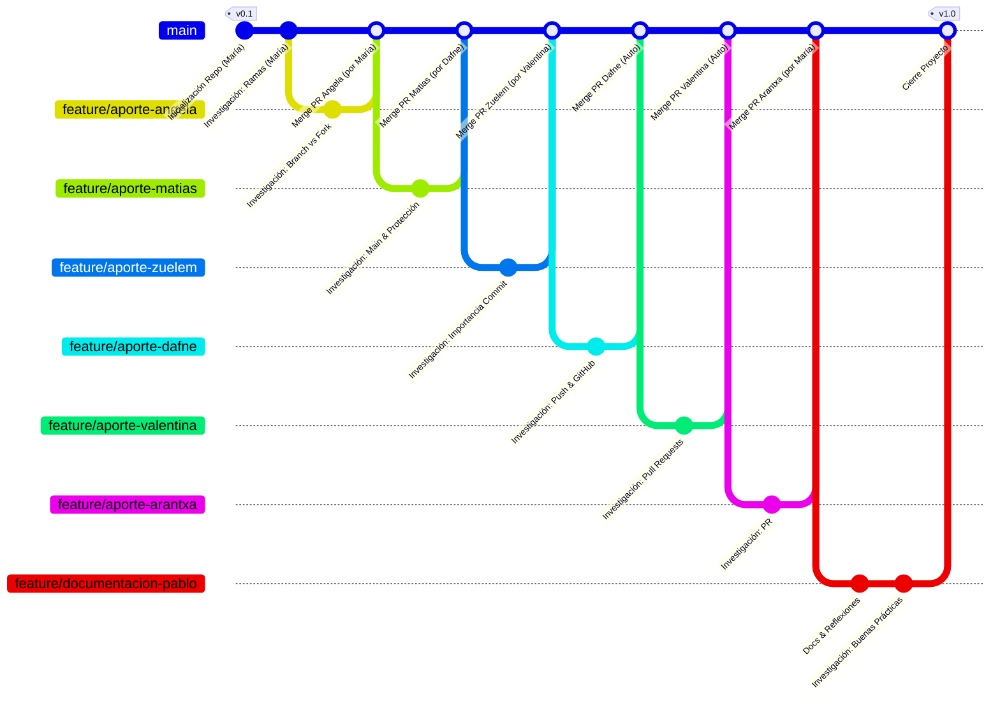

# Documentacion de procesos

## 👤 Asignacion de alumnos

- **María Riquelme (ALUMNA 1) [Dueña Repositorio Original]**: https://github.com/raiksha 
- **Angela Galleguillos (ALUMNA 2) [Contribuidor Externo 1]**: https://github.com/AngieG-dev
- **Matias Flores (ALUMNO 3) [Contribuidor Externo 2]**: https://github.com/MatRoig
- **Zuelem Chanillao (ALUMNA 4) [Contribuidor Externo 3]**: https://github.com/zuelem
- **Dafne Mandujano (ALUMNA 5) [Revisor de Pull Request 1]**: https://github.com/DMandujano
- **Valentina Llanten (ALUMNA 6) [Revisor de Pull Request 2]**: https://github.com/CodeMochi-dev
- **Arantxa Fischer (ALUMNA 7) [Apoyo Actualización Fork y Nueva Rama]**: https://github.com/a-scarfisch
- **Pablo Fuentes (ALUMNO 8) [Documentador Proceso]**: https://github.com/PabloDesk

---

## 🗒️ Resumen General

- Alumna 1 (María | raiksha ): Crea el repositorio llamado "actividad-branching-git" de forma local para después ser subida de forma remota en GitHub, agregando además en README.md integrantes, objetivos y su investigación (*¿Qué es una rama en Git?*).

- Alumna 2 (Angela | AngieG-dev): Hizo fork de forma local. Creo nueva rama llamada "AngieG-dev:feature/feature-aporte-alumno2". Modifico archivo `README.md` para agregar su investigación (*¿Qué diferencia hay entre branch y fork?*). Agrego commit con descripción clara. Realizo Push para enviar el commit al repositorio de Github. Genero Pull Request en Github.

- Alumna 1 (María | raiksha ): Aprobó Pull Request de Alumno 2 (Angela | AngieG-dev). Elimina rama llamada "AngieG-dev:feature/feature-aporte-alumno2" para mantener repositorio ordenado.

- Alumno 3 ( Matias | MatRoig): Hizo fork de forma local. Creo nueva rama llamada "AngieG-dev:feature/feature-aporte-alumno3". Modifico archivo `README.md` para agregar su investigación (*¿Qué es `main` y por qué se protege?*). Agrego commit con descripción clara. Realizo Push para enviar el commit al repositorio de Github. Genero Pull Request en Github.

- Alumna 5 ( Dafne | DMandujano): Aprobó Pull Request de Alumno 3 ( Matias | MatRoig ). Elimina rama llamada "MatRoig:feature/feature-aporte-alumno3" para mantener repositorio ordenado.

- Alumna 4 ( Zuelem ): Hizo fork de forma local. Creo nueva rama llamada "Zuelem:feature/aporte-alumno4". Modifico archivo `README.md` para agregar su investigación (*¿Qué es un commit y por qué es importante?*). Agrego commit con descripción clara. Realizo Push para enviar el commit al repositorio de Github. Genero Pull Request en Github.

- Alumna 6 ( Valentina | CodeMochi-dev ): Aprobó Pull Request de Alumno 3 ( Matias | MatRoig ). Elimina rama llamada "Zuelem:feature/aporte-alumno4" para mantener repositorio ordenado.

- Alumna 5: ( Dafne | DMandujano ): Hizo fork de forma local. Creo nueva rama llamada "DMandujano:feature/aporte-alumno5". Modifico archivo `README.md` para agregar su investigación (*¿Qué es push y qué relación tiene con GitHub?*). Agrego commit con descripción clara. Realizo Push para enviar el commit al repositorio de Github. Genero Pull Request en Github. Aprobó su Pull Request. Elimina rama llamada "DMandujano:feature/aporte-alumno5" para mantener repositorio ordenado.

- Alumna 6 ( Valentina | CodeMochi-dev ): Hizo fork de forma local. Creo nueva rama llamada "CodeMochi-dev:feature/aporte-alumno6". Modifico archivo `README.md` para agregar su investigación (*¿Qué es un Pull Request?*). Agrego commit con descripción clara. Realizo Push para enviar el commit al repositorio de Github. Genero Pull Request en Github. Aprobó su Pull Request. Elimina rama llamada "CodeMochi-dev:feature/aporte-alumno6" para mantener repositorio ordenado.

- Alumna 7 ( Arantxa | a-scarfisch ): Hizo fork de forma local. Creo nueva rama llamada "a-scarfisch:feature-aporte-alumno7". Modifico archivo `README.md` para agregar su investigación (*¿Qué es merge y qué podría salir mal?*). Agrego commit con descripción clara. Realizo Push para enviar el commit al repositorio de Github. Genero Pull Request en Github.

- Alumna 1 (María | raiksha ): Aprobó Pull Request de Alumna 7 ( Arantxa | a-scarfisch ). Elimina rama llamada "a-scarfisch:feature-aporte-alumno7" para mantener repositorio ordenado.

- Alumno 8 ( Pablo | pablodesk ): Hizo fork de forma local. Creo nueva rama llamada "feature/documentacion". Creo archivo `documentacion.md` para agregar documentación del equipo. Agrego commit con descripción clara. Realizo Push para enviar el commit al repositorio de Github. Genero Pull Request en Github. Aprobó su Pull Request.

- Alumno 8 ( Pablo | pablodesk ): Crea Carpeta "Reflexiones" y dentro de este creo archivo `Reflexion_grupal.md` para agregar las reflecciones del grupo. Agrego commit con descripción clara. Realizo Push para enviar el commit al repositorio de Github. Genero Pull Request en Github. Aprobó su Pull Request.

- Alumno 8 ( Pablo | pablodesk ): Hizo fork de forma local. Creo nueva rama llamada "PabloDesk:feature-aporte-alumno8". Modifico archivo `README.md` para agregar su investigación (*Buenas prácticas al trabajar con ramas*). Agrego commit con descripción clara. Realizo Push para enviar el commit al repositorio de Github. Genero Pull Request en Github. Aprobó su Pull Request.

## 🕒 Línea de Tiempo del Proyecto: actividad-branching-git

A continuación se detalla el flujo de trabajo seguido por el equipo, desde la creación del repositorio hasta la consolidación de la documentación final.

---

## Conclusión Final del Proceso

- Como conclusión personal, cabe destacar la importancia de definir con precisión los roles y responsabilidades dentro del repositorio de GitHub. Una asignación clara de tareas, sumada a una comunicación fluida entre los integrantes, es fundamental para garantizar la eficiencia del flujo de trabajo.

## Conclusión del equipo (Documentación)

- Para que un equipo de desarrollo funcione con éxito, es fundamental que la asignación de roles y responsabilidades en GitHub sea transparente, ya que esto evita la duplicidad de tareas y los conflictos críticos en el código (como los merge conflicts). Mantener un flujo de trabajo estructurado, respaldado por una comunicación constante y asertiva a través de Pull Requests y Issues, garantiza que cada integrante comprenda su impacto en el proyecto; esto no solo optimiza los tiempos de entrega, sino que fortalece la cohesión del grupo al transformar el repositorio en un entorno de colaboración eficiente y ordenado.
